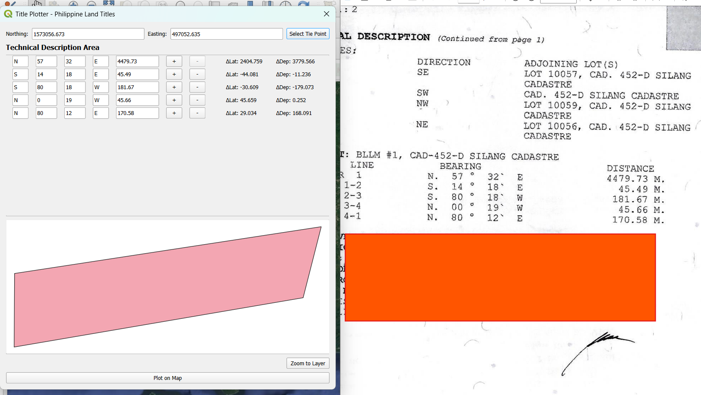
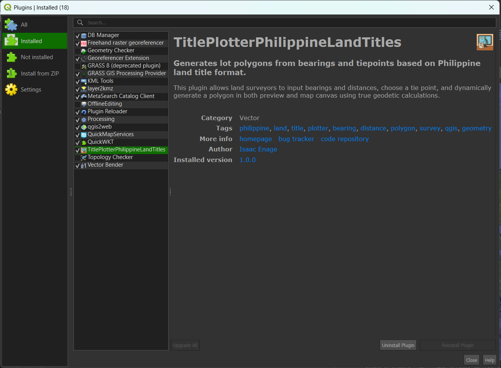
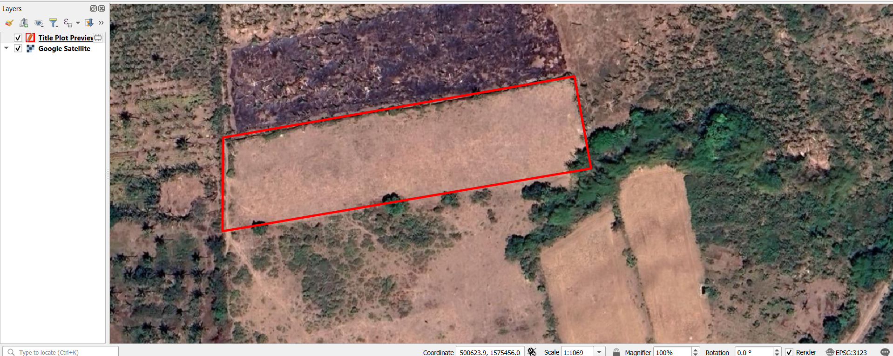

# Title Plotter – Philippine Land Titles


**Title Plotter – Philippine Land Titles** is a QGIS plugin that allows users to visualize land parcels described in technical formats common in Philippine land titles. It converts bearing-distance descriptions and a tie point into a georeferenced polygon, viewable both on a preview canvas and optionally plotted on the active QGIS map.

---

## Features

- ✅ **Input Bearing + Distance** data in vertical table format (e.g. `N 69 16 E – 704.05`).
- ✅ Automatically computes **ΔLat** and **ΔDep** using trigonometry.
- ✅ Accepts a **Tie Point** (Northing/Easting) as the spatial anchor of the polygon.
- ✅ Real-time preview of the polygon within a **scrollable, zoomable, pan-enabled canvas**.
- ✅ Supports **Zoom to Layer** for quick navigation to the previewed geometry.
- ✅ Option to **Plot the final polygon on the QGIS map** using WKT geometry.
- ✅ Prevents plotting if the current map is using **EPSG:4326 (WGS84)**, which is incompatible with most projected survey data.
- ✅ Fully scrollable **bearing-distance input panel**, keeping the layout fixed and clean.
- ✅ Compatible with QGIS 3.x and above.
- ✅ Lightweight, fast, and follows local cadastral standards.

---

## Screenshots

| Input Bearings & Distances | Preview Panel | Plotted on Map |
|---------------------------|----------------|----------------|
|  |  |  |

---

## Installation

### Option 1: Plugin Manager
1. Download or clone this repository:
2. Go to **Plugins → Manage and Install Plugins**
3. Install from ZIP
4. Browser your downloaded zip file
5. Click **Install Plugin**

### Option 2: Manual Installation
1. Download or clone this repository:
```bash
git clone https://github.com/isaacenage/TitlePlotterPH.git
```

2. Copy the entire folder to your QGIS profile plugin directory:
```
C:\Users\<YourUsername>\AppData\Roaming\QGIS\QGIS3\profiles\default\python\plugins
```

3. Launch QGIS and enable the plugin in **Plugins > Manage and Install Plugins**

---

## How It Works

1. Enter the **tie point** (Northing, Easting) manually or from a predefined table.
2. For each **bearing + distance line**, the plugin:
   - Converts degrees + minutes into a decimal angle.
   - Computes ΔLat = Distance × Cos(angle)
   - Computes ΔDep = Distance × Sin(angle)
   - Applies ±1 depending on quadrant (N/S, E/W)
   - Calculates the next point using the previous (NT, ET)
3. When you hit **Plot on Map**, it generates a `POLYGON ((ET1 NT1, ET2 NT2, ...))` and places it on the map as a memory layer.

---

## Notes and Best Practices

- Do not use this plugin with EPSG:4326 maps. Always switch to a **projected CRS**, e.g., **EPSG:32651 (UTM Zone 51N)** or a **PRS92-based local grid**.
- Ensure your bearings follow the format: `N/S`, `Degrees`, `Minutes`, `E/W`, and `Distance`.
- Only the first `n-1` segments will generate coordinates; the closing line (last segment) is inferred automatically.

---

## Icon

This plugin uses a custom icon (`icon.png`) included in the root directory. You can change the icon by replacing `icon.png` and updating `metadata.txt`.

---

## Developer Notes

- **Main class:** `TitlePlotterPhilippineLandTitles`
- **Dialog UI:** `Title_Plotter_Philippine_Land_Titles_dialog.ui`
- **Entry point:** `__init__.py` and `metadata.txt`
- Built using **Python 3.12**, **Qt Designer**, and **QGIS Plugin Builder 3**

---

## To-Do / Feature Roadmap

- [ ] Support for exporting to KML/GeoJSON
- [ ] Support for transforming WKT to PRS92 Zone I/II
- [ ] Auto-labeling of parcel corners
- [ ] PDF/printable survey map output

---

## Contact

**Author:** Isaac Enage  
**Email:** isaacenagework@gmail.com  
**GitHub:** [github.com/isaacenage](https://github.com/isaacenage)

---

## 📄 License

This plugin is licensed under the [GNU License](LICENSE).

---

## 🔍 Tags

`philippine` `land` `title` `plotter` `bearing` `distance` `polygon` `survey` `cadastral` 
